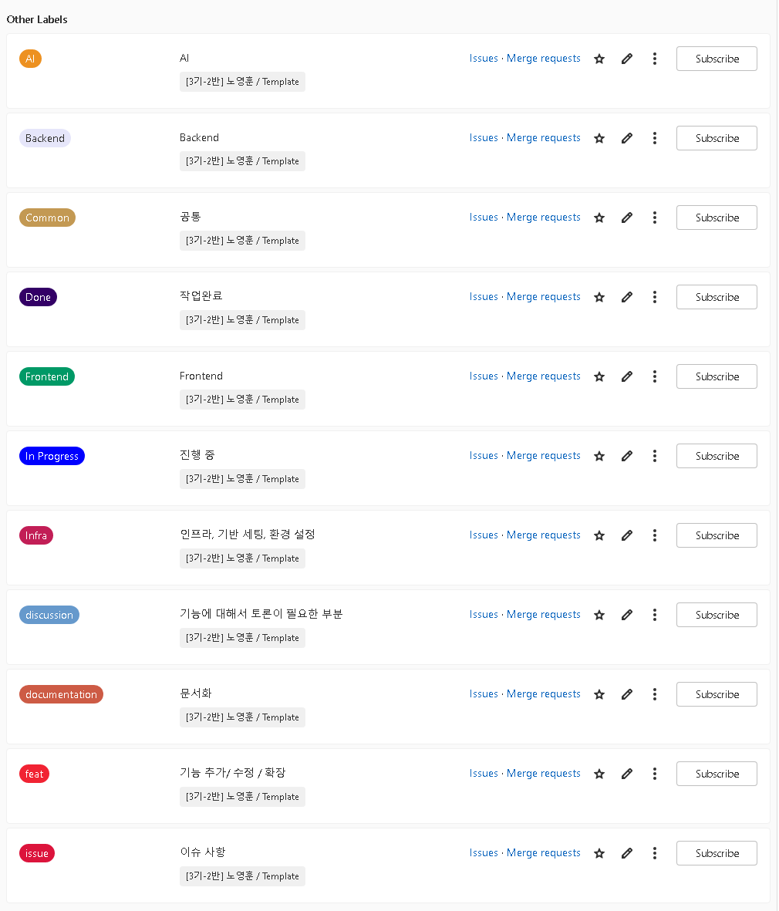
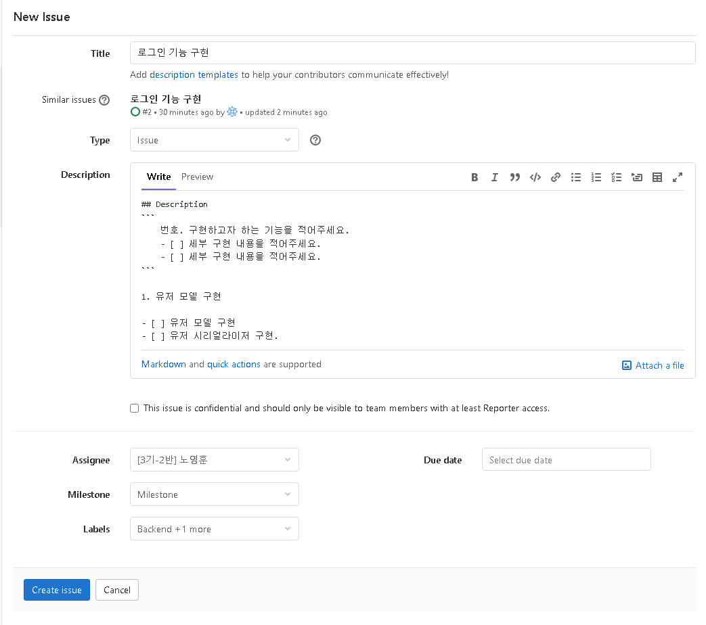
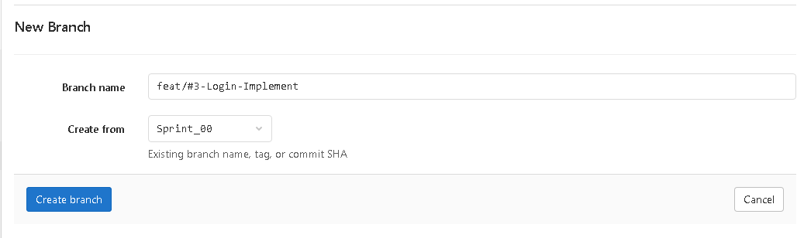
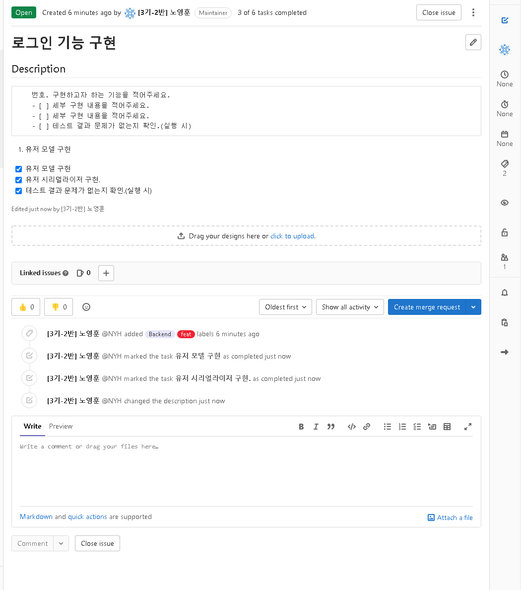
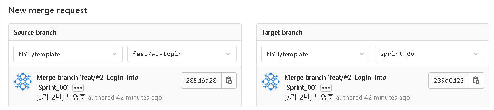
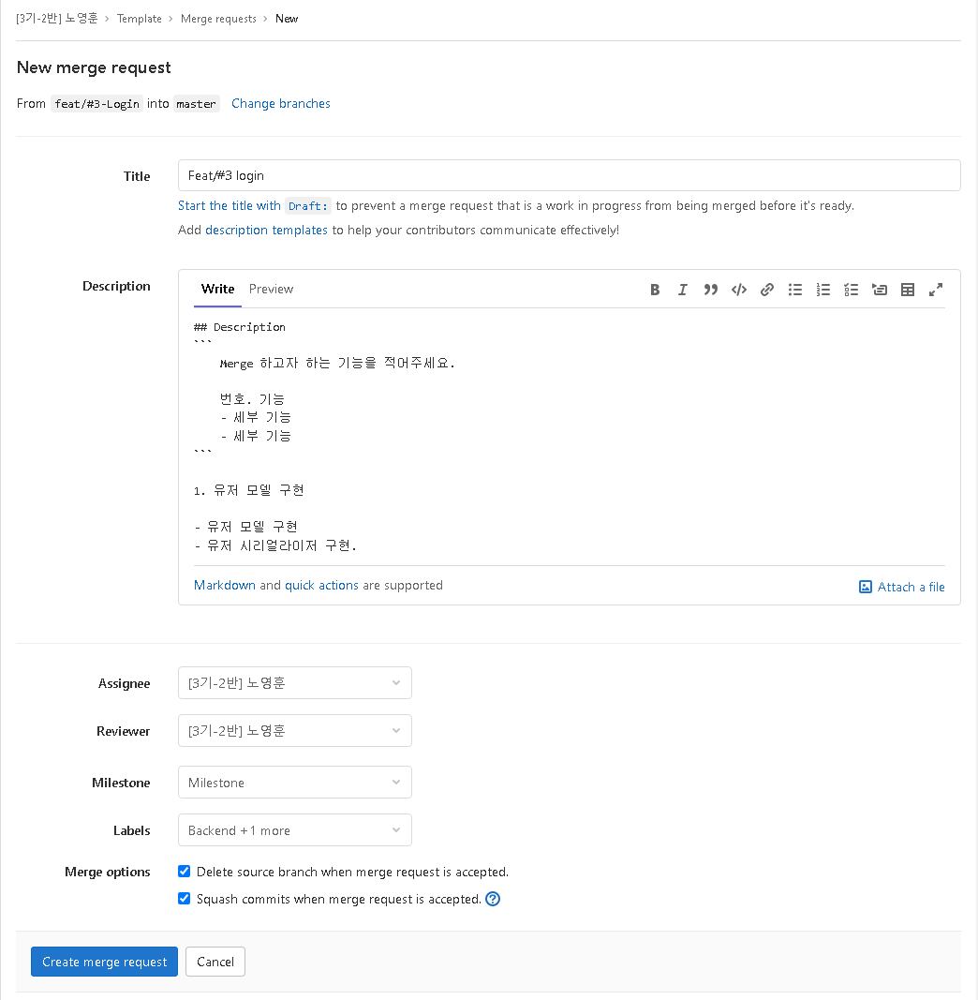
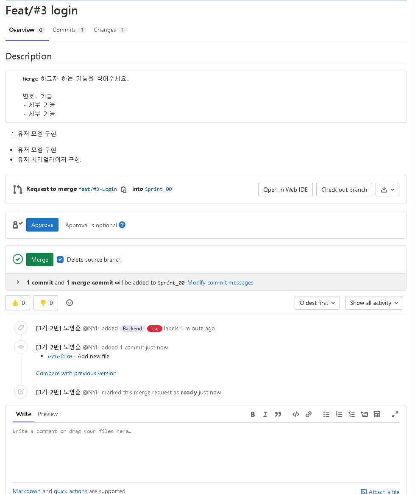

## GitLab 규칙

## 1. 라벨 사용

1. AI : AI 직군
2. Backend : Backend 직군
3. Frontend : Frontend 직군
4. Done : 작업완료
5. In Progress : 진행 중
6. Infra : 인프라, 기반 세팅, 환경 설정
7. discussion : 기능에 대해서 토론이 필요한 부분
8. documentation : 문서화
9. feat : 기능 추가 / 수정 / 확장
10. issue : 이슈 사항

## 2. 작업 순서

1. 이슈 등록.
    - GitLab 홈으로 이동한다.
    - Issues에서 New Issue를 클릭한다.
    - Assignee에서 본인을 선택한다. 
    - Label에서 본인의 직군과 수행하고자 하는 일에 맞는 라벨을 선택한다.
    - IssueTemplate을 복사해서 구현하고자 하는 일을 세분화 해서 기입한다.

    - 작업 예시

    

2. 작업에 맞는 브랜치 생성.

    - 작업 번호와 라벨 확인

    

    - 작업 번호와 라벨에 맞는 브랜치 생성
        - 이 때 브랜치는 `sprint` 브랜치에서 생성할 것.
        - 해당 예제에서는 `Backend`, `feat` 이므로 직군 인 `Backend`를 제외한 `feat/#3-Login` 이라는 브랜치 생성

    

3. 작업이 완료된 경우.

    - 작업 번호에 맞는 이슈 확인
        - 체크 리스트 확인 후 `Close issue`

        

    - 작업 번호에 맞는 브랜치에서 merge request 생성
        - merge request는 생성한 브랜치에서 sprint브랜치로 수행할 것.

          

        - 기입 부분에서 MergeTemplate사용
        - Assignee은 본인 선택
        - Reviewer는 본인 제외한 직군의 다른 사람 선택.
        - Label은 본인이 이슈에서 선택했던 내용 그대로 선택.
        - Merge options는 둘 다 선택.
        - Create merge request

        
    
    - 선택된 Reviewer는 작업 내용을 확인 후 Approve를 눌러주고 Merge 한다.

    