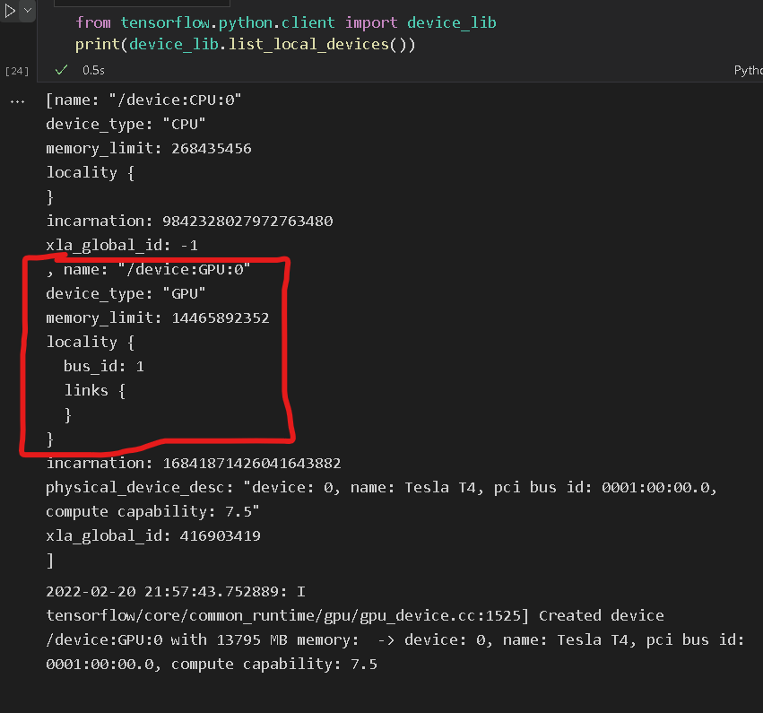

# VM 학습 환경 설정

## 1. NVIDIA 그래픽 카드 드라이버 설치

### gcc compiler 설치

의존하는 파일이 많으므로 설치한다. ex) cuda
```
sudo apt install gcc
```


### wget을 통해 linux nvidia driver 파일을 가져온다.

```bash
wget https://us.download.nvidia.com/tesla/460.106.00/NVIDIA-Linux-x86_64-460.106.00.run
```

### 설치 파일 권한을 재설정

```bash
chmod a+x NVIDIA-Linux-x86_64-460.106.00.run
```

### sudo 권한으로 드라이버 설치 시작

```bash
chmod a+x NVIDIA-Linux-x86_64-460.106.00.run
```

### 설치 진행 후 확인

```bash
nvidia-smi
```

## [2. CUDA,CUDNN 설치](https://webnautes.tistory.com/1479)

```
위의 링크 누른 후
CUDA 11.2 설치,
cuDNN 8.1.0 설치 부분 까지 따라하기.
```

## 3. Tensorflow 에서 CUDA GPU 사용하기

### Tensorflow GPU 사용 가능 여부 확인



```python
from tensorflow.python.client import device_lib
print(device_lib.list_local_devices())
```

### 학습 시 GPU 가속 이용

```python
# 코드 예시
with tf.device("/device:GPU:0"):
    model.fit(X_train, y_train, epochs=2000, callbacks=[tb_callback])
```

## Reference
- [CUDA, CUDNN](https://webnautes.tistory.com/1479)
- elice document 참고