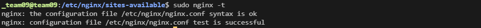
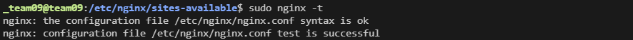

## GitLab 규칙

## 1. gunicorn/nginx config 설정 경로

- gunicorn.service, socket 경로: /etc/systemd/system/
- nginx.conf 경로: /etc/nginx/sites-available/
  - sudo ln -sf /etc/nginx/sites-available/mysite.conf /etc/nginx/sites-enabled/ (conf파일 생성후 심볼릭링크 필요)

## 2. gunicorn/nginx service파일 명령어

1. 데몬 재시작: sudo systemctl daemon-reload
   - service 파일 수정 시에 데몬 재시작이 필요함
2. 서비스 시작: sudo systemctl start [서비스명]
   - 시작 순서: gunicorn.socket -> gunicron.service (service먼저 실행되면 에러 발생)
3. 서비스 중지: sudo systemctl stop gunicorn
4. 서비스 재시작: sudo systemctl restart gunicorn
5. 서비스 상태보기 sudo systemctl status gunicorn
6. 서비스 등록: sudo systemctl enable gunicorn
7. 서비스 해제: sudo systemctl disable gunicorn

## 3. gunicorn/nginx 에러 로그

1. gunicorn.sock파일 생성 확인: file /run/gunicorn.sock
   - 정상연결: 
2. nginx 연결확인: sudo nginx -t
   - 정상연결: 
3. nginx 에러로그: tail -(출력원하는숫자)f /var/log/nginx/error.log
4. 에러로그: sudo journalctl -u gunicorn.socket

## 4. nginx 명령어

1. next.js 빌드: npm run build
2. next.js 시작: npm run start

## 5. 기타 명령어

1. django로 시작: manage.py runserver 0:8000
2. static 파일모음: python3 manage.py collectstatic
